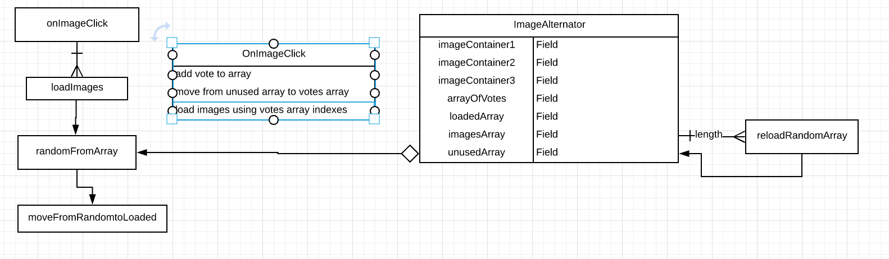

# bus-mall

As skymall customer, I want comfortable user interface, so that it won't offend my eyes

As skymall owner, I want to have accurate research numbers, so that I can source the right products

As skymall owner, I want to hide the data results until the end of the reasearch, so that we have unbaised numbers

As X, I want Y, so that Z

As X, I want Y, so that Z

. 

To Do... 

- Create an array of images
- Add listeners to  tags
- On Click:
    - show new image
    - remove image from image array to prevent showing it twice
    - 